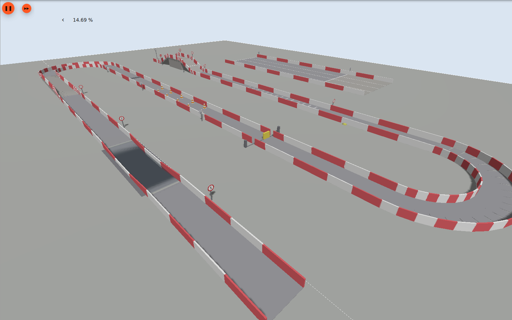

<div align="center">

# ika_parkur_gazebo

**The complete TEKNOFEST 2026 Unmanned Ground Vehicle competition course, for Gazebo**

[](https://docs.ros.org/en/jazzy/)
[](https://gazebosim.org/docs/harmonic)
[](https://releases.ubuntu.com/24.04/)
[](LICENSE)
[](tools/verify.py)



</div>

## What you get

Every stage of the competition specification as one Gazebo world. Geometry is not
hand-modelled: `generator/generate.py` reads every dimension from
`generator/config.yaml` — where each value carries the spec section it came from — and
emits `worlds/ika_parkur.sdf`. `tools/verify.py` then measures the generated world back
against the spec, clause by clause: **49 checks**, exits non-zero on any failure.

| # | Stage | Spec | What is modelled |
|---|-------|------|------------------|
| 1 | Water crossing | §6.3 | 40 cm pit with sloped banks, a hole cut in the ground, buoyancy plugin, visual-only water |
| 2 | Gravel / stony road | §6.4 | Flat named zone (loose stones omitted) |
| 3 | Side slope | §6.5 | 20 % banked road, low edge held at ground level |
| 4 | Vertical block | §6.6 | 15 cm full-width step |
| 5 | Traffic cones | §6.7 | 10 orange/white cones, dynamic — they topple when clipped |
| 6 | Sliding obstacle | §6.8 | 1 m blade on a prismatic joint, 20 cm/s, driven by a ROS 2 node |
| 7 | Rough terrain | §6.9 | 28 trapezoid bumps in two staggered series |
| 8 / 10 | Steep ramps | §6.10 | 45 % climb and descent, painted stop lines + STOP / DUR plates |
| 9 | Firing zone | §6.10 | A3 target at exactly 10.00 m, ring diameters 6/12/18 cm |
| 11 | Acceleration strip | §6.11 | 4 lanes × 3 m, 30 m timed + 10 m stopping, outside the main course |

Plus a 3 m road, continuous red-and-white barriers through every curve (§6.1), and
numbered 60 cm stage signs a detector can read (§6.2). Centerline 250.84 m, footprint
116 × 84 m, 57 models / 702 links.

Two things are deliberately left out, both documented at the point in `config.yaml`
where they would live: the rain sprinkler over the water crossing (§6.3), and the loose
stones of stage 2 (§6.4). Both are camera problems a simulator cannot reproduce honestly;
stage 2 stays as a flat named zone so stage numbering and downstream distances stay
correct.

## Requirements

| | |
|---|---|
| OS | Ubuntu 24.04 (native or WSL2) |
| ROS 2 | Jazzy Jalisco |
| Simulator | Gazebo Sim 8 (Harmonic) |
| Python | 3.10+ |

```bash
sudo apt install ros-jazzy-ros-gz-sim ros-jazzy-ros-gz-bridge python3-yaml
```

The repo ships the generated world and every texture, so you do **not** need anything
beyond the above to run the course. Pillow (`pip install pillow`) is only needed if you
change `config.yaml` and re-run the generator to rebuild the sign textures.

The stage signs use 'Arial Black' (§6.2), which Ubuntu does not ship. Without it the
generator falls back to the heaviest available substitute and says so. To get the real
font:

```bash
sudo apt install ttf-mscorefonts-installer
cd generator && python3 generate.py --textures
```

## Install

```bash
# into a colcon workspace
mkdir -p ~/ros2_ws/src && cd ~/ros2_ws/src
git clone https://github.com/AbdullahSa723/teknofest-2026-ika-parkur.git ika_parkur_gazebo

# build
cd ~/ros2_ws
colcon build --packages-select ika_parkur_gazebo
source install/setup.bash

# launch
ros2 launch ika_parkur_gazebo parkur.launch.py
```

> **WSL2:** if the source lives on `/mnt/c`, do not run `colcon build` there — drvfs turns
> every file operation into a cross-OS round trip and the build crawls. `tools/sync_and_build.sh`
> copies the package onto the WSL filesystem, builds, and (with `--run`) launches it.

## License

[MIT](LICENSE).

The TEKNOFEST specification document itself is not redistributed here; dimensions are
transcribed with their section references so you can check every one against your own
copy. This is an independent implementation and is not affiliated with or endorsed by
T3 Vakfı or TEKNOFEST.
